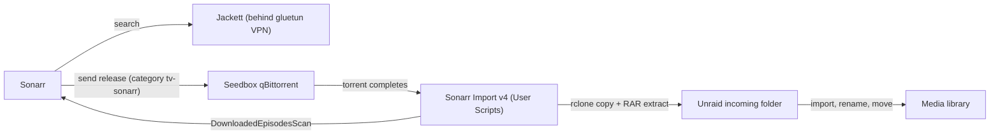

# Sonarr Import v4


Pulls completed Sonarr downloads from a remote seedbox to Unraid **exactly once**, extracts any RAR archives, and tells Sonarr to import them.

Runs as an Unraid **User Scripts** entry (every 10 minutes). Nothing needs to be installed or scripted on the seedbox.

## Table of contents

- [How the pipeline works](#how-the-pipeline-works)
- [Changes from v3](#changes-from-v3)
- [Requirements](#requirements)
- [Setup](#setup)
- [Files and state](#files-and-state)
- [Troubleshooting](#troubleshooting)
- [Security notes](#security-notes)

## How the pipeline works



1. **Sonarr** finds a missing episode and searches via **Jackett** (I recommend behind a gluetun VPN).
2. Sonarr sends the release to the **remote seedbox qBittorrent** with the category `tv-sonarr`.
3. qBittorrent downloads it into the seedbox download folder.
4. Every 10 minutes, **this script**:
   1. Logs in to the qBittorrent Web API and lists torrents in the `tv-sonarr` category that are 100% complete.
   2. Skips any torrent whose hash is already in the local ledger.
   3. Gets the torrent's exact file list from the API (wanted files only, samples excluded).
   4. Copies only those files from the seedbox to the local `incoming` folder with `rclone copy` (inside the rclone Docker container).
   5. Extracts RAR sets locally, removing archive parts only after confirming media exists.
   6. Records the hash in the ledger so the torrent is never pulled again.
   7. If anything new arrived, fixes permissions and triggers a Sonarr `DownloadedEpisodesScan`.
5. **Sonarr** imports, renames and moves the episode into the library using its remote path mapping.
6. A separate **cleanup script** (every 24h) removes items older than 24 hours from `incoming`.

## Changes from v3

| | v3 | v4 |
|---|---|---|
| **Transfer method** | `rclone sync` of the whole seedbox download folder | `rclone copy` of only the files of completed `tv-sonarr` torrents |
| **Deciding what to pull** | Everything on the seedbox not present locally | qBittorrent Web API: completed torrents in the category that are not in the ledger |
| **Re-downloads** | Yes: deleted rars, imported files and cleaned-up folders were pulled again every 10 minutes while the torrent kept seeding | No: each torrent hash is pulled once |
| **Overlapping runs** | Possible, with two instances fighting over the same files | Prevented with `flock` |
| **Sonarr trigger** | `manualImport` command with the host path | `DownloadedEpisodesScan` with the Sonarr container path, only when something new arrived |
| **Parallelism** | 2 transfers / 2 checkers | 4 transfers, multi-thread streams enabled |
| **Logging** | `--progress` output in the log | Periodic one-line stats; log rotates at 10 MB |
| **Extraction** | Scanned the whole incoming folder every run | Only the folder just pulled; archives kept if extraction fails |
| **Permissions** | `chown -R` on the whole incoming tree | Only recently modified files |
| **Seedbox side** | An external program hook (`olaris-rename`) ran on completion | Hook removed; nothing runs on the seedbox |

> [!NOTE]
> **Why this matters:** v3 mirrored the seedbox, so anything removed locally (extracted archives, imported files, the 24h cleanup) was downloaded again on the next run. That wasted bandwidth and was the main cause of slow, repeated transfers.

## Requirements

### Unraid

- [User Scripts](https://forums.unraid.net/topic/48286-plugin-ca-user-scripts/) plugin
- `jq` (included in recent Unraid releases; otherwise install via NerdTools)
- `unrar` or `7z` for extracting RAR archives
- Docker with an rclone container (this setup uses `binhex-rclone`) that can reach the seedbox
- A local landing folder on a cache-backed share, mounted into the rclone container and visible to Sonarr (default `/mnt/user/media/incoming`)

### Seedbox

- qBittorrent with the Web UI reachable from Unraid (the same URL Sonarr uses); use `https` if available
- An rclone remote (SFTP in this setup) that can read the download folder
- Torrents saved under the folder configured as `REMOTE_ROOT`

### Sonarr

- qBittorrent configured as a download client with **Category** set to `tv-sonarr`
- The download client's **Tags** field empty (or matching the series' tags)
- A remote path mapping from the seedbox download folder to the local incoming folder, as seen by Sonarr
- An API key (Settings → General)

> [!IMPORTANT]
> If the download client has a tag that the series does not, Sonarr reports: *"No download client was found without tags or a matching series tag."* Clear the tag on the client, or add it to the series.

## Setup

1. Make sure the seedbox qBittorrent has no **Run external program on torrent finished** entry that moves or renames files.
2. Create the User Scripts entry and paste in the script. Fill in the configuration block at the top (qBittorrent URL and login, category, paths, Sonarr API key).
3. If the script was edited on Windows, convert the line endings:

   ```bash
   sed -i 's/\r$//' "/boot/config/plugins/user.scripts/scripts/Sonarr Import v4/script"
   ```

4. Wait until Sonarr's queue is empty, then run once with `--bootstrap` to mark every currently complete torrent as already handled:

   ```bash
   bash "/boot/config/plugins/user.scripts/scripts/Sonarr Import v4/script" --bootstrap
   ```

   > [!WARNING]
   > Skip this step and the first scheduled run will treat every completed torrent as new and pull the entire backlog from the seedbox.

5. Run it again without the flag. It should log `Nothing new to pull.`
6. Disable the old v3 schedule and schedule v4 with the custom cron `*/10 * * * *`.
7. Test with a single episode and follow the log:

   ```bash
   tail -f /mnt/user/logs/SONARR_import.log
   ```

   Expect `Pulling`, `Done`, then `Sonarr scan queued`, and then check Sonarr's History for the import.

## Files and state

| Path | Purpose |
|---|---|
| `/mnt/user/logs/SONARR_import.log` | Log (rotated at 10 MB to `.1`) |
| `/mnt/user/appdata/seedbox-pull/pulled_hashes.txt` | Ledger of pulled torrent hashes |
| `<incoming>/.pull-lists/` | Temporary per-torrent file lists |

To force a torrent to be pulled again, remove its hash from the ledger.

## Troubleshooting

<details>
<summary><code>invalid option name</code> or <code>$'\r': command not found</code></summary>

The script has Windows line endings. Run the `sed` command from [Setup](#setup) step 3.

</details>

<details>
<summary><code>qBittorrent login failed</code></summary>

Wrong URL, username or password, or the Web UI is not reachable from Unraid.

</details>

<details>
<summary>Nothing is ever pulled</summary>

`QBIT_CATEGORY` does not exactly match the category set in Sonarr (it is case-sensitive), or no torrents in that category are complete yet.

</details>

<details>
<summary><code>Skipping '...': save path is outside REMOTE_ROOT</code></summary>

The torrent's save path is not under `REMOTE_ROOT`. Fix the category's save path in qBittorrent or adjust `REMOTE_ROOT`.

</details>

<details>
<summary>Sonarr says "no files found" briefly</summary>

qBittorrent reported the torrent finished before the local copy landed. Sonarr retries, so this is normal.

</details>

<details>
<summary>Files arrive but are not imported</summary>

Check the Sonarr container path in the script, the remote path mapping, and Sonarr's System → Logs.

</details>

<details>
<summary>Transfers are slow</summary>

Test a single large file with `rclone copy -P` to see whether the limit is SFTP overhead or the seedbox uplink. Tune with `RCLONE_EXTRA` (for example `--sftp-concurrency`).

</details>

## Security notes

> [!CAUTION]
> The script contains the qBittorrent login and the Sonarr API key. Do not share or commit it as is.

- User Scripts live on the Unraid flash drive, which does not enforce file permissions and is included in flash backups.
- Optionally move the secrets to a `chmod 600` file on the array and `source` it from the script.
- Use an `https` qBittorrent URL if the seedbox offers one, so the password is not sent in cleartext.
